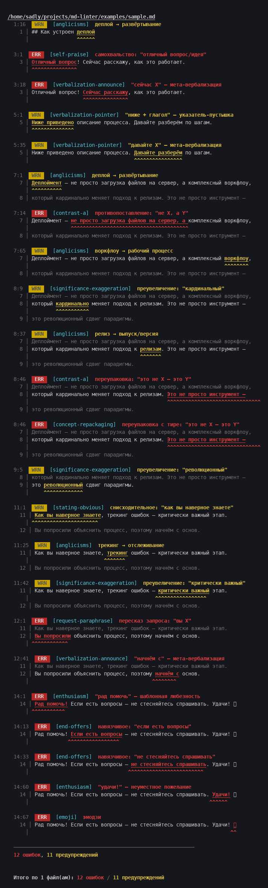

# anti-llm-linter

CLI-линтер для обнаружения LLM-антипаттернов в русскоязычных текстах: англицизмы, мета-вербализация, самохвальство, раздутие текста и многое другое. Можно использовать как skill для Claude Code.

---

### Пример

Исходный текст — [`examples/sample.md`](examples/sample.md):

```
## Как устроен деплой

Отличный вопрос! Сейчас расскажу, как это работает.

Ниже приведено описание процесса. Давайте разберём по шагам.

Деплоймент — не просто загрузка файлов на сервер, а комплексный воркфлоу,
который кардинально меняет подход к релизам. Это не просто инструмент —
это революционный сдвиг парадигмы.
...
```

Вывод линтера:



### Установка

```bash
npm install
```

### Использование

```bash
# Проверка одного или нескольких файлов
node cli.js file.md
node cli.js report.pdf doc.docx article.html

# Чтение из stdin
cat file.md | node cli.js -

# При глобальной установке
anti-llm-linter file.md
```

Код выхода `1`, если найдена хотя бы одна ошибка (`error`), `0` — если всё чисто.

### Поддерживаемые форматы

| Формат | Расширения |
|---|---|
| Markdown | `.md` |
| Обычный текст | `.txt`, `.text` |
| reStructuredText | `.rst` |
| AsciiDoc | `.adoc`, `.asciidoc` |
| HTML | `.html`, `.htm` |
| PDF | `.pdf` |
| Word | `.docx` |

Для PDF и DOCX из документа извлекается только текст; форматирование игнорируется.

### Правила

| ID правила | Уровень | Описание |
|---|---|---|
| `emoji` | error | Эмодзи и пиктограммы |
| `arrows` | error | Стрелки Unicode |
| `checkmarks` | error | Галочки и крестики Unicode |
| `anglicisms` | warning | Англицизмы и кальки (деплой, фидбек, пайплайн…) |
| `verbalization-announce` | error | Мета-вербализация — анонс ответа ("сейчас расскажу", "давайте разберём") |
| `verbalization-pointer` | warning | Указатели-пустышки ("ниже приведено", "вот что") |
| `request-paraphrase` | error | Пересказ запроса пользователя ("вы попросили", "в вашем запросе") |
| `self-praise` | error | Самохвальство и комплименты вопросу ("отличный вопрос", "исчерпывающий обзор") |
| `enthusiasm` | error | Наигранный восторг ("конечно!", "с удовольствием!", "рад помочь") |
| `significance-exaggeration` | warning | Преувеличение значимости ("революционный", "смена парадигмы") |
| `contrast-a` | error | Навязчивые противопоставления ("не X, а Y", "с одной стороны") |
| `concept-repackaging` | error | Переупаковка концепций ("это уже не просто X, а Y") |
| `correcting-user` | error | Поправление формулировок пользователя ("вы имели в виду", "точнее говоря") |
| `stating-obvious` | warning | Проговаривание очевидного ("как всем известно", "важно понимать") |
| `text-inflation` | warning | Фразы-паразиты ("таким образом,", "подводя итог", "следует отметить") |
| `end-offers` | error | Навязчивые предложения в конце ("если есть вопросы", "готов помочь") |

### Конфигурация

Создайте файл `anti-llm-linter.config.json` в рабочей директории:

```json
{
  "extendRules": {
    "anglicisms": [
      { "regex": "/\\bоупенсорс[а-яё]*/gi", "message": "оупенсорс → открытый исходный код" }
    ]
  },
  "addRules": [
    {
      "id": "my-rule",
      "name": "Моё правило",
      "severity": "warning",
      "patterns": [
        { "regex": "/паттерн/gi", "message": "паттерн → шаблон" }
      ]
    }
  ],
  "disableRules": ["text-inflation"]
}
```

- **`extendRules`** — добавить паттерны к существующему встроенному правилу.
- **`addRules`** — добавить полностью новые правила.
- **`disableRules`** — отключить встроенные правила по ID.

### Вывод

Для каждой находки выводятся: уровень серьёзности, ID правила, строка/столбец, найденный фрагмент и контекст вокруг него с указателями на место совпадения. После проверки всех файлов печатается итоговая сводка.
